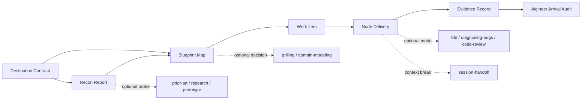

# Aigineer Skill 能力架构

> 状态：v0.2 核心能力已实现，正在通过真实任务观察触发成本和边界。
>
> 目标：假设没有现成 Skill，设计一套能单独采用、组合低耦合、围绕“目的地优先 + 地图收敛 + 按节点施工”的个人开发能力。本文是能力边界和组合规则，不是某个项目的业务流程。

## 1. 设计结论

核心不应是“每个阶段一个 Skill”，而应是：

```text
aigineer                    唯一入口：阶段路由、状态投影、写入门槛、到达协议
    |
    +-- destination-shaping  目标契约
    +-- repository-recon     仓库事实与影响面
    +-- blueprint-planning   路线地图与决策收敛
    +-- node-slicing         地图节点到施工简报
    +-- node-delivery        节点施工、验证和审查
```

按需旁路能力：

```text
blueprint-planning --> grilling / research / prior-art / prototype / domain-modeling
node-delivery      --> tdd / diagnosing-bugs / code-review
跨会话             --> session-handoff
明显摩擦           --> retro
面向用户的价值问题 --> simulate-demanding-users（仅作合成用户预检）
```

关键取舍：

1. `aigineer` 是入口，不复制所有子 Skill 的正文。
2. `destination-shaping`、`repository-recon`、`blueprint-planning`、`node-slicing`、`node-delivery` 各自拥有独立输入、输出和完成条件。
3. `impact-mapping` 并入 `repository-recon`，因为它依赖同一批仓库事实，单独分发会制造中间状态。
4. `evidence-auditor` 并入 `node-delivery` 的节点证据和 `aigineer` 的到达审计；它没有稳定的独立用户工作。
5. `arrival-audit` 是入口协议，不是额外 Skill；它决定何时可以宣布到达。
6. `product-validation` 和 `release-action` 不进入默认链路，分别属于产品价值和外部动作边界；目前按需停放。

## 2. 能力卡

| 能力 | 用户问题 | 主责 | 不负责 | 输入 | 输出 | 分发形态 | 复用裁决 |
| --- | --- | --- | --- | --- | --- | --- | --- |
| `aigineer` | Agent 如何记住当前阶段并阻止过早写入？ | 路由、状态、门槛、到达协议 | 目标判断、测试实现、产品授权 | 用户阶段语句、状态文件 | 状态投影、gate 结果 | 入口 Skill + CLI | `absorb` 现有地图优先规则 |
| `destination-shaping` | “做个功能”怎样变成可验收目的地？ | 价值、结果、验收、范围、非目标 | 仓库扫描、代码设计、用户替代决策 | 用户请求、已有上下文 | Destination Contract | 独立 Skill | `absorb` Matt `grilling`，`build` 本地契约 |
| `repository-recon` | 改动会影响什么，哪些是事实，哪些仍未知？ | 事实清单、影响面、探针候选 | 解决产品取舍、实施代码、盲猜根因 | Destination Contract、仓库 | Recon Report | 独立 Skill | `build`，吸收 `domain-modeling` 和架构扫描思想 |
| `blueprint-planning` | 从现状到目的地的路线怎样可解释、可恢复？ | 节点、转移、分支、回滚、探针 | 直接实施目的地、替用户批准 | Destination Contract、Recon Report | Blueprint Map | 独立 Skill/本地 Markdown | `adapt` Matt `wayfinder` 到本地文件地图 |
| `node-slicing` | 地图的一步怎样变成可施工工作？ | 写入范围、前置条件、完成状态、验证命令 | 重新定义目的地、编写代码 | 已批准 Blueprint Map | Work Item | 独立 Skill | `absorb` Matt `to-tickets` 的 vertical slice |
| `node-delivery` | 如何只实施当前节点并证明它？ | 范围内实现、测试、验证、审查、证据边界 | 选择目的地、发布外部系统 | 已批准 Work Item | Code/Test Diff + Evidence | 独立 Skill | `adapt` Matt `implement`，组合本地 `tdd`/`diagnosing-bugs`/`code-review` |
| `session-handoff` | 中断后如何无损续接？ | 检查点和目的地证据 | 重新规划或替代项目文档 | 活跃地图和状态 | Checkpoint | 已有 Skill，按需 | `adopt` 本地能力 |
| `retro` | 哪些流程摩擦值得改？ | 复盘和改进建议 | 当前任务实现 | 完成回报和摩擦 | Retro Note | 已有 Skill，按需 | `adopt` 本地能力 |

## 3. 共享契约

Skill 之间只通过文件化 artifact 连接，不通过隐含对话状态或互相调用内部函数连接。

### Destination Contract

```yaml
kind: destination
schema_version: 1
statement: "〈可观察的最终状态〉"
value: "〈谁在什么场景得到什么结果〉"
acceptance:
  - id: A1
    proof: "〈可执行命令或可观察结果〉"
scope:
  in_scope: ["〈允许改动〉"]
  out_of_scope: ["〈明确不做〉"]
boundaries: ["〈需要停下请求授权的动作〉"]
```

### Recon Report

```yaml
kind: recon
schema_version: 1
destination_ref: "〈destination artifact〉"
verified_facts:
  - claim: "〈事实〉"
    evidence: "〈文件、命令或测试输出〉"
impact:
  callers: []
  callees: []
  shared_contracts: []
  generated_artifacts: []
  regression_surfaces: []
unknowns:
  - id: U1
    question: "〈会改变路线的未知〉"
    probe: "〈直接查证 / research / prior-art / prototype〉"
```

### Blueprint Map

```yaml
kind: blueprint
schema_version: 1
destination_ref: "〈destination artifact〉"
status: draft
nodes:
  - id: N1
    from: "〈现状〉"
    action: "〈一次可执行动作〉"
    to: "〈预期状态〉"
    writes: ["〈写入范围〉"]
    preconditions: ["〈前置条件〉"]
    verification: ["〈验证命令或观察〉"]
    rollback: "〈回退、替代分支或重规划入口〉"
    on_failure: replan
transitions:
  - from: N1
    to: N2
    when: "〈出口条件〉"
```

### Work Item

```yaml
kind: work-item
schema_version: 1
map_ref: "〈blueprint map〉"
node: N1
goal: "〈本节点用户结果〉"
writes: ["〈声明写集〉"]
preconditions: ["〈当前 gate 条件〉"]
verification: ["〈实际要运行的命令〉"]
non_goals: ["〈本节点不做〉"]
rollback: "〈回退、替代分支或重规划入口〉"
```

### Evidence Record

```yaml
kind: evidence
schema_version: 1
node: N1
claim: "〈声称达到的状态〉"
checks:
  - command: "〈实际命令〉"
    result: pass
    observed: "〈实际输出摘要〉"
limits:
  simulated: ["〈mock 或原型边界〉"]
  unverified: ["〈未执行的检查〉"]
  product_unknowns: ["〈工程证据不能推出的价值问题〉"]
```

## 4. 依赖方向



依赖原则：

- 上游只输出契约和证据，不调用下游内部实现。
- 下游可以拒绝不完整输入，但不能偷偷补全关键缺口。
- 可选 Skill 是“模式提供者”，不成为核心 Skill 的硬依赖。
- `aigineer` 维护阶段和状态，但不拥有 Destination/Recon/Work Item 的全部正文。

## 5. 任务分辨率

### Quick

目标明确、范围局部、一次即可验证：在当前对话执行 `destination-shaping` 的精简版，内联最小 `node-slicing` 和 `node-delivery`，不落盘完整地图；仍要明确写集、验收和证据。

### Standard

行为变化、跨文件或有一次以上取舍：落盘 Destination Contract、Recon Report、Blueprint Map 和一个 Work Item。

### Deep

架构、数据、安全、迁移、外部动作或跨会话：完整运行五个核心 Skill，使用 `aigineer` gate、检查点和审查；外部动作另走授权门槛。

分辨率可向上升级；不能用降低分辨率规避新证据暴露的风险。

## 6. 独立性判定

一个 Skill 只有同时满足以下条件才保留为独立分发单元：

1. 有独立用户问题；
2. 有独立触发情境；
3. 输入和输出可以文件化；
4. 有自己的完成条件和失败边界；
5. 不需要读取另一个 Skill 的私有状态；
6. 用户可以只采用它而不安装整套工作流。

按此判定：

- `impact-mapping` 合并进 `repository-recon`；
- `evidence-auditor` 合并进 `node-delivery + aigineer`；
- `arrival-audit` 保持入口协议；
- `product-validation` 和 `release-action` 作为未来按需边界能力；
- `aigineer` 保留为组合入口，不强迫所有独立 Skill 反向依赖它。

## 7. 最小纵向切片

第一版不实现完整 Skill Hub，也不做自动 Skill 编排。核心 Skill 的最小可用链是：

```text
用户目标
  -> destination-shaping 生成 Destination Contract
  -> repository-recon 生成一份事实/影响面报告
  -> blueprint-planning 生成一条含 N1 的路线
  -> 用户批准
  -> node-slicing 生成 N1 Work Item
  -> node-delivery 实施和验证 N1
  -> aigineer 记录节点证据并进行到达审计
```

如果这条链在真实任务中不能稳定减少返工，继续拆 Skill 没有价值。
